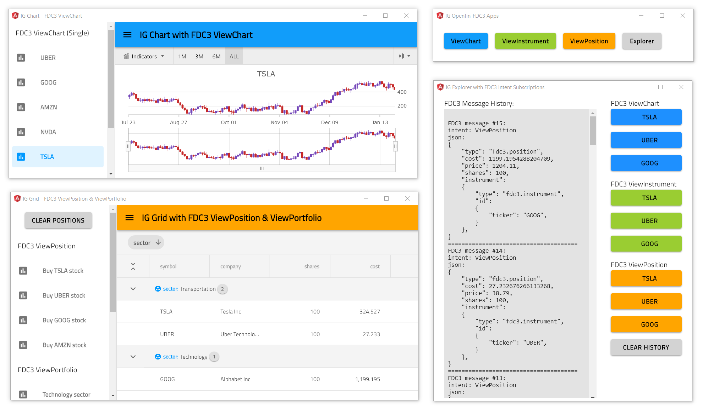

## IG Explorer with multiple FDC3 intents

This view is part of Angular Stock application that demonstrates how to use [Financial Chart](https://infragistics.com/angularsite/components/financial-chart.html) component with [FDC3 Data Adapter](https://www.npmjs.com/package/igniteui-angular-fdc3) to handle `ViewChart`, `ViewInstrument`,`ViewPosition`, and `ViewPortfolio` intent messages sent via [OpenFin FDC3](https://developers.openfin.co/docs/fdc3) service.

To get more information please refer to this [ReadMe](../../../README.md) page.

## Code Snippet

The following code snippet shows how to create FDC3 data adapter and subscribe to multiple FDC3 intents.

```ts
import { Fdc3DataAdapter } from "igniteui-angular-fdc3"
import { Fdc3Message } from 'igniteui-angular-fdc3';

// importing OpenFin FDC3 service
import * as openfinFdc3 from "openfin-fdc3";
// ...

// creating FDC3 data adapter with reference to openfin
this.FDC3adapter = new new Fdc3DataAdapter(openfinFdc3);

// subscribing to multiple FDC3 intents
this.FDC3adapter.subscribe("ViewChart");
this.FDC3adapter.subscribe("ViewInstrument");
this.FDC3adapter.subscribe("ViewPosition");
this.FDC3adapter.subscribe("ViewPortfolio");

this.FDC3adapter.messageReceived = (msg: Fdc3Message) => {
    console.log(msg.json);
};
```

 

