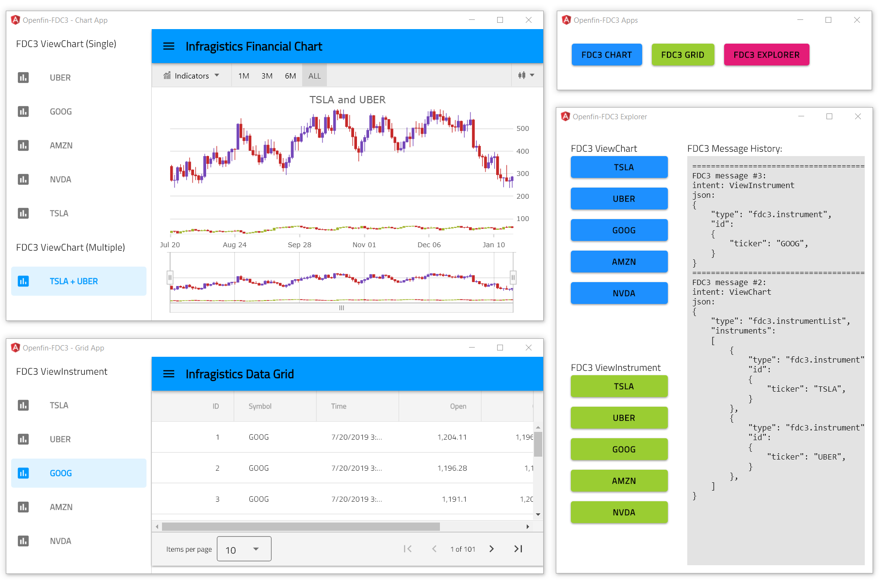

#### Infragistics Stock Application with FDC3 data adapter

The Angular Stock application demonstrates how to use [Financial Chart](https://infragistics.com/angularsite/components/financial-chart.html) component with [FDC3 Data Adapter](https://www.npmjs.com/package/igniteui-angular-fdc3) to handle [ViewChart](https://fdc3.finos.org/docs/1.0/intents-intro) intent messages sent via [OpenFin FDC3](https://developers.openfin.co/docs/fdc3) service. Also, it shows how you can send single and multiple financial stock instruments as context of ViewChart and ViewInstrument intent messages.

You can run this application locally in [OpenFin](https://developers.openfin.co/docs/openfin-os/) window by following [these](https://github.com/Infragistics/demo-apps/tree/master/angular/open-fin-stock-app#running) instructions. Also, you can run this application with other applications that use OpenFin FDC3 service to communicate with each other.



## Table of Contents

- [Components](#Components)
- [Code Snippets](#Code-Snippets)
    - [Creating FDC3 Data Adapter](#Creating-FDC3-Data-Adapter)
    - [Sending FDC3 Messages](#Sending-FDC3-Messages)
- [Installation](#Installation)
- [Running](#Running)
- [Testing](#Testing)


## Components

This application is using the following Infragistics components:

- [Financial Chart](https://infragistics.com/angularsite/components/financial-chart.html)
- [Data Grid](https://www.infragistics.com//angularsite/components/grid/grid.html)
- [Zoom Slider](https://infragistics.com/angularsite/components/zoomslider-overview.html)
- [FDC3 Data Adapter](https://www.npmjs.com/package/igniteui-angular-fdc3)

## Code Snippets

#### Creating FDC3 Data Adapter

The following code snippet shows how to create FDC3 data adapter and subscribe to ViewChart intent which will be handled and generate data for binding to Infragistics [Angular Financial Chart](https://infragistics.com/angularsite/components/financial-chart.html) component.

```ts
import { Fdc3DataAdapter } from "igniteui-angular-fdc3"
import { Fdc3Message } from 'igniteui-angular-fdc3';
// importing OpenFin FDC3 service
import * as openfinFdc3 from "openfin-fdc3";
// ...

// creating FDC3 data adapter with reference to openfin
this.FDC3adapter = new new Fdc3DataAdapter(openfinFdc3);
// subscribing to FDC3 "ViewChart" intent
this.FDC3adapter.subscribe("ViewChart");
// handling FDC3 intents sent via OpenFin's FDC3 service
this.FDC3adapter.messageReceived = (msg: Fdc3Message) => {
    // binding financial chart to data
    this.financialChart.dataSource = this.FDC3adapter.stockPrices;
};
```

#### Sending FDC3 Messages

This code snippet show how to send FDC3 **ViewChart** intent that can be consumed by [Financial Chart](https://infragistics.com/angularsite/components/financial-chart.html) component.

```ts
import { Fdc3Instrument } from 'igniteui-angular-fdc3';
// ...

// creating context for FDC3 message
let context = new Fdc3Instrument();
context.ticker = "TSLA";
// sending FDC3 ViewChart intent to 'IgStockAppUID' app
this.FDC3adapter.sendInstrument("ViewChart", context, "IgStockAppUID");
```

This code snippet show how to send FDC3 **ViewInstrument** intent that can be consumed by [Data Grid](https://www.infragistics.com//angularsite/components/grid/grid.html) component.

```ts
import { Fdc3Instrument } from 'igniteui-angular-fdc3';
// ...

// creating context for FDC3 message
let context = new Fdc3Instrument();
context.ticker = "TSLA";
// sending FDC3 ViewInstrument intent to 'IgStockAppUID' app
this.FDC3adapter.sendInstrument("ViewInstrument", context, "IgStockAppUID");
```

## Installation

Set up this project by following these instructions:

- open **VS Code** as administrator
- open the folder that contains this repository, e.g. `C:\Github\openfin-stock-app`
- select **Terminal** - **New Terminal** menu item
- run this command to install openfin-cli
```
npm install -g openfin-cli
```

- run this command to install required packages for this app

```
npm install
```

## Running

1. Run this command to host this app locally in a browser:

```
npm run-script start
```

2. Wait until you see this message:

**Angular Live Development Server is listening on localhost:4500**

3. Open your browser at [localhost:4500](http://localhost:4500/) address.

Note while running in a browser, the app does not support any **OpenFin** actions (e.g. [FDC3 ViewChart](https://fdc3.finos.org/docs/1.0/intents-intro) intent) because they require connection to host it from **OpenFin** launcher.

4. Therefore, you need to open a new terminal (**Terminal** - **New Terminal** menu item)

5. Run this command to start **OpenFin** launcher and host the app in an **OpenFin** window, where all functionalities are enabled, e.g. [FDC3 ViewChart](https://fdc3.finos.org/docs/1.0/intents-intro):

```
npm run-script openfin
```


## Testing

While this Angular app is running in **OpenFin** window, you can send FDC3 messages from provided FDC3 Explorer window or you run other applications that use [OpenFin FDC3](https://developers.openfin.co/docs/fdc3) service.


## Further help

To get more help on the Angular CLI use `ng help` or go check out the [Angular CLI README](https://github.com/angular/angular-cli/blob/master/README.md).
