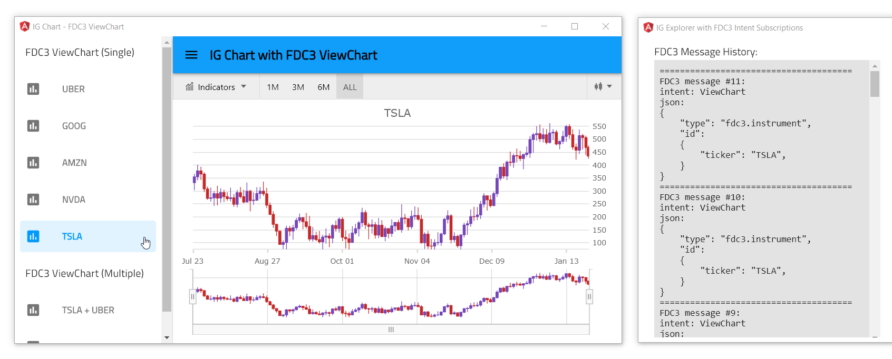

## IG Chart with FDC3 ViewChart Intent

This view is part of Angular Stock application that demonstrates how to use [Financial Chart](https://infragistics.com/angularsite/components/financial-chart.html) component with [FDC3 Data Adapter](https://www.npmjs.com/package/igniteui-angular-fdc3) to handle [ViewChart](https://fdc3.finos.org/docs/1.0/intents-intro) intent messages sent via [OpenFin FDC3](https://developers.openfin.co/docs/fdc3) service.

To get more information please refer to this [ReadMe](../../../README.md) page.

## Code Snippet

This code snippet show how to send FDC3 **ViewChart** intent that can be consumed by [Financial Chart](https://infragistics.com/angularsite/components/financial-chart.html) component.

```ts
import { Fdc3Instrument } from 'igniteui-angular-fdc3';
import { IgxFinancialChartComponent } from "igniteui-angular-charts";
// ...

// creating context for FDC3 message
let instrument = new Fdc3Instrument();
instrument.ticker = "TSLA";
// sending FDC3 ViewChart intent to 'IgStockAppUID' app
this.FDC3adapter.sendInstrument("ViewChart", instrument, "IgStockAppUID");

// handling FDC3 ViewChart intent
this.FDC3adapter.subscribe("ViewChart");
this.FDC3adapter.messageReceived = (msg: Fdc3Message) => {
    this.chart.dataSource = this.FDC3adapter.stockPrices;
};
```



