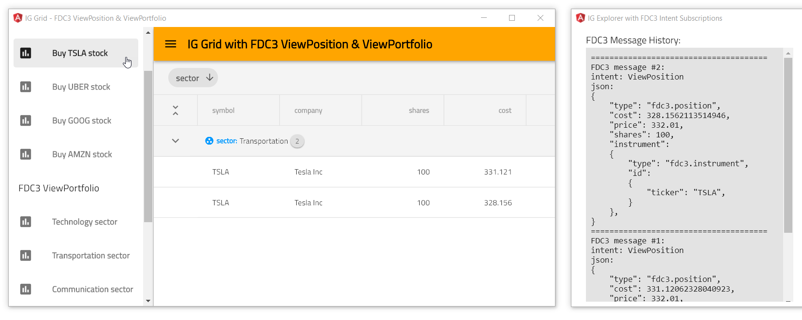
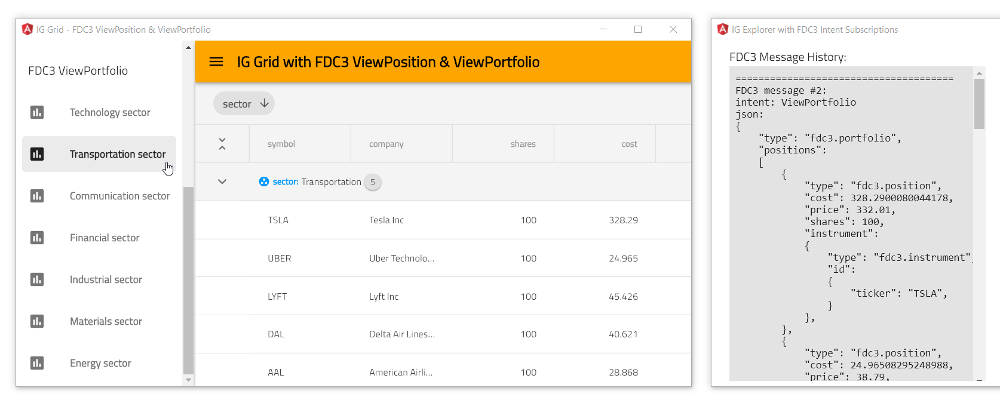

## IG Grid with FDC3 ViewPosition and ViewPortfolio

This view is part of Angular Stock application that demonstrates how to use [Financial Chart](https://infragistics.com/angularsite/components/financial-chart.html) component with [FDC3 Data Adapter](https://www.npmjs.com/package/igniteui-angular-fdc3) to handle `ViewPosition` and `ViewPortfolio` intent messages sent via [OpenFin FDC3](https://developers.openfin.co/docs/fdc3) service:

To get more information please refer to this [ReadMe](../../../README.md) page.


## Table of Contents

- [Code Snippets](#Code-Snippets)
    - [Sending FDC3 ViewPosition](#Sending-FDC3-ViewPosition)
    - [Sending FDC3 ViewPortfolio](#Sending-FDC3-ViewPortfolio)

## Code Snippets

#### Sending FDC3 ViewPosition

```ts
import { Fdc3Instrument } from 'igniteui-angular-fdc3';
import { Fdc3Position } from "igniteui-angular-fdc3";
import { IgxGridComponent  } from "igniteui-angular";
// ...

let instrument = new Fdc3Instrument();
instrument.ticker = "TSLA";

// creating context for FDC3 message
let position = new Fdc3Position();
position.instrument = instrument;
// optional setting properties for purchase order:
position.shares = 100;
position.price = details.marketPrice;

// sending FDC3 ViewPosition intent to 'IgStockAppUID' app
this.FDC3adapter.sendPosition("ViewPosition", position, "IgStockAppUID");

// handling FDC3 ViewPosition intent
this.FDC3adapter.subscribe("ViewPosition");
this.FDC3adapter.messageReceived = (msg: Fdc3Message) => {
    this.grid.data = this.FDC3adapter.stockPositions;
};
```



#### Sending FDC3 ViewPortfolio

```ts
import { Fdc3Instrument } from 'igniteui-angular-fdc3';
import { Fdc3Position } from "igniteui-angular-fdc3";
import { IgxGridComponent  } from "igniteui-angular";
// ...

let instrumentA = new Fdc3Instrument();
instrumentA.ticker = "TSLA";
let positionA = new Fdc3Position();
positionA.instrument = instrument;

let instrumentB = new Fdc3Instrument();
instrumentB.ticker = "UBER";
let positionB = new Fdc3Position();
positionB.instrument = instrument;

// creating context for FDC3 message
const portfolio = new Fdc3Portfolio();
portfolio.positions.push(positionA);
portfolio.positions.push(positionB);

// sending FDC3 ViewPortfolio intent to 'IgStockAppUID' app
this.FDC3adapter.sendPortfolio("ViewPortfolio", portfolio, "IgStockAppUID");

// handling FDC3 ViewPortfolio intent
this.FDC3adapter.subscribe("ViewPortfolio");
this.FDC3adapter.messageReceived = (msg: Fdc3Message) => {
    this.grid.data = this.FDC3adapter.stockPositions;
};
```



