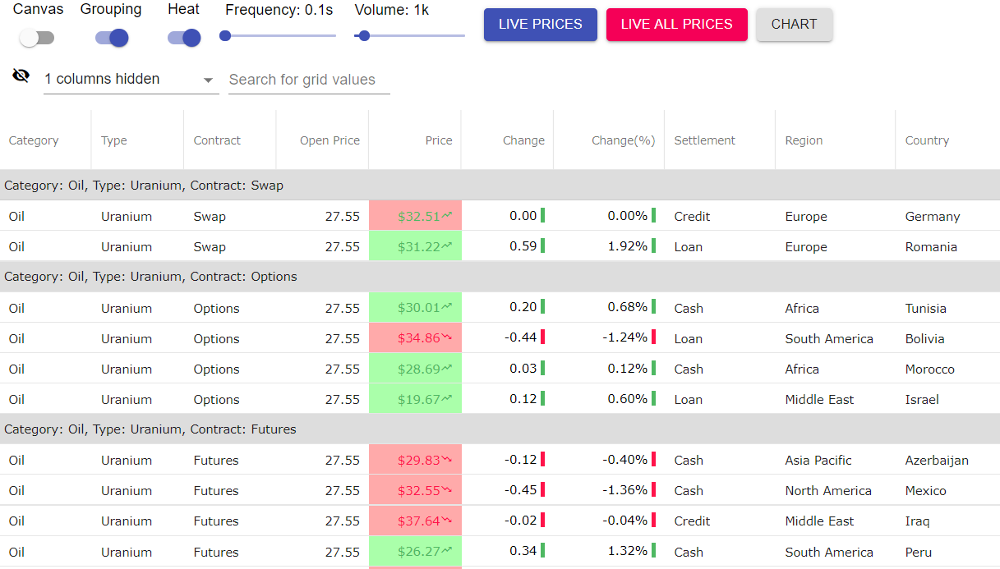

## React Live-Data Grid App

This repository contains implementation of React app showing performance of the [React Data Grid](https://staging.infragistics.com/reactsite/components/grid_table.html), by binding thousands of financial records, grouping them by 3 columns (Category, Type, Contact), and live-updating multiple columns every couple of milliseconds. You can change various options in real-time and the Data Grid performance with no lag, screen flicker, or visual delay

## Preview

You can find online version of this application on this [website](https://infragistics.com/react-demos/grids/data-grid-live-data) or you can edit this app in [stackblitz](https://stackblitz.com/edit/finjs-demo).

## Available Scripts

In the project directory, you can run:

### `npm start`

Runs the app in the development mode. 
Open [http://localhost:3700](http://localhost:3700) to view it in the browser.

The page will reload if you make edits. 
You will also see any lint errors in the console.

### `npm run build`

Builds the app for production to the `build` folder. 
It correctly bundles React in production mode and optimizes the build for the best performance.

The build is minified and the filenames include the hashes. 
Your app is ready to be deployed!

See the section about [deployment](https://facebook.github.io/create-react-app/docs/deployment) for more information.

## Learn More

You can learn more in the [Create React App documentation](https://facebook.github.io/create-react-app/docs/getting-started).

To learn React, check out the [React documentation](https://reactjs.org/).
