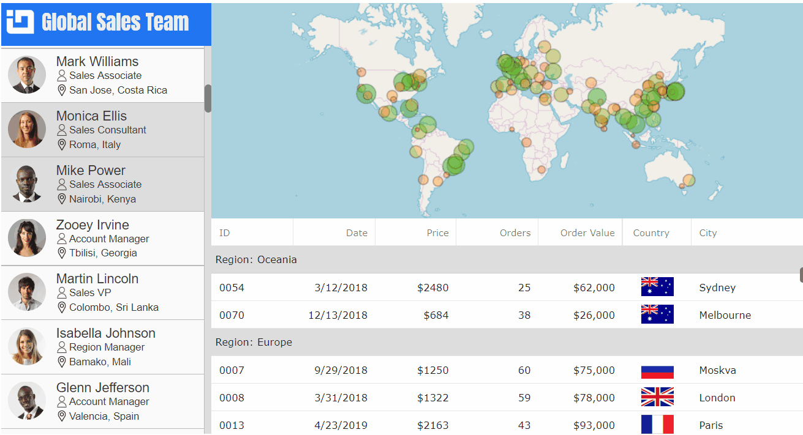

## Introduction

This repository contains implementation of React master-detail view using of Ignite UI for React components.



## Table of Contents

- [Introduction](#Introduction)
- [Background](#Background)
- [Setup](#Setup)
- [Building Project](#Building-Project)
- [Running App](#Running-App)
- [Folder Structure](#Table-of-Contents)
- [Supported Browsers](#supported-browsers)

## Background

This project was bootstrapped with [Create React App](https://github.com/facebookincubator/create-react-app).

Below you will find some information on how to perform common tasks.<br>
You can find the most recent version of this guide [here](https://github.com/facebookincubator/create-react-app/blob/master/packages/react-scripts/template/README.md).

## Setup

To setup this project:

- open VS Code as Administrator
- open the folder that contains this repository, e.g. `C:\react-samples\`
- select **View** - **Terminal** menu item
- run this command:

```
npm install
```

This will install required packages and Ignite UI for React packages from npm website:

- [igniteui-react-core](https://www.npmjs.com/package/igniteui-react-core)
- [igniteui-react-grids](https://www.npmjs.com/package/igniteui-react-grids)
- [igniteui-react-maps](https://www.npmjs.com/package/igniteui-react-maps)


## Building Project
To build the project run:

```
npm build
```

## Running App
To start the dev server run:

```
npm start
```


## Folder Structure

This project has the following structure:

```
my-app/
  README.md
  package.json
  public/
    index.html
    favicon.ico
  src/
    index.css
    index.js
    assets/
    data/
    views/

```

## Supported Browsers

By default, the generated project uses the latest version of React.

You can refer [to the React documentation](https://reactjs.org/docs/react-dom.html#browser-support) for more information about supported browsers.
