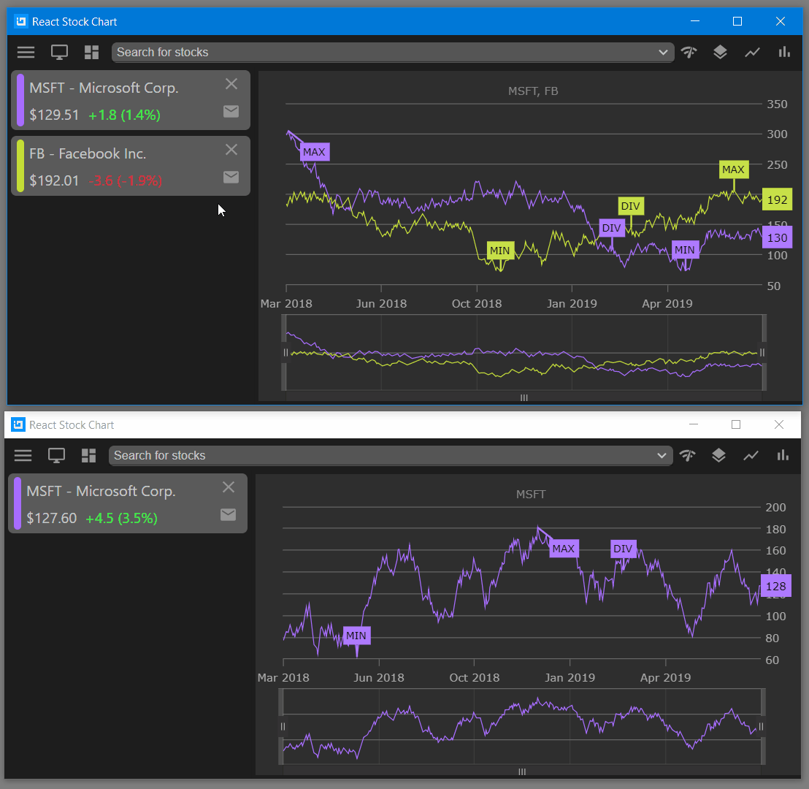
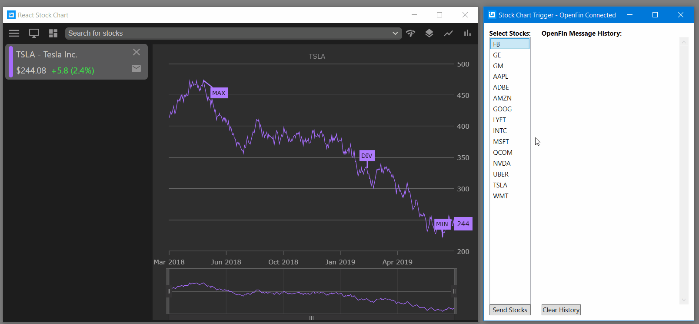

## React Stock Chart App

This repository demonstrates how create and host React app in [OpenFin](https://openfin.co/) launcher and use [FDC3](https://fdc3.finos.org/docs/1.0/fdc3-intro) protocol to display [React Financial Chart](https://infragistics.com/reactsite/components/financialchart.html) component.

## Table of Contents

- [Setup](#Setup)
- [Running](#Running)
- [Testing](#Testing)



## Setup

Setup this project by following these instructions:

- open **VS Code** as administrator
- open the folder that contains this repository, e.g. `C:\repositories\demo-apps\open-fin\stock-market-chart`
- select **Terminal** - **New Terminal** menu item
- run this command to install required packages and Ignite UI for React packages from npm website

```
npm install
```

## Running

Run this command to host this app locally in a browser:

```
npm run-script start
```

Note this React app running in a browser, does not support any **OpenFin** actions (e.g. Send Stock as FDC3 message) because they require connection to host it from **OpenFin** launcher:


Therefore, you need to open a new terminal (**Terminal** - **Split Terminal** menu item) and run this command:

```
npm run-script openfin:dev
```

This will start **OpenFin** launcher and host the app in **OpenFin** window, where all functionalities are enabled, e.g. Send Stock to a new window via [FDC3 ViewChart](https://fdc3.finos.org/docs/1.0/intents-intro)


## Testing

While this React app is running in **OpenFin** launcher, you can also run other applications that use [FDC3](https://fdc3.finos.org/docs/1.0/fdc3-intro) protocol. For example, you can run WPF app called [OpenFin Stock Chart Trigger](https://github.com/Infragistics/demo-apps/tree/master/wpf/open-fin-stock-chart-trigger) to send stock symbol using [FDC3 ViewChart](https://fdc3.finos.org/docs/1.0/intents-intro) to this React app. Also you can see content of those messages.

