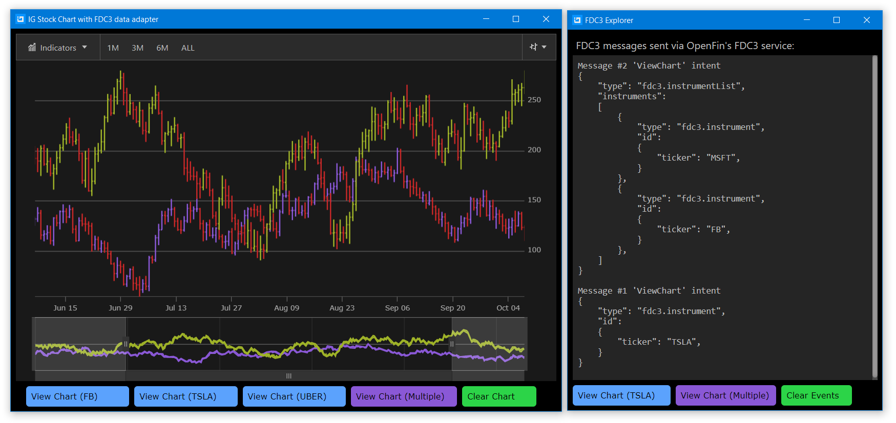

#### Infragistics Stock Chart App with FDC3 data adapter

The React Stock Chart application demonstrates how to use [Financial Chart](https://infragistics.com/reactsite/components/financial-chart.html) component with [FDC3 Data Adapter](https://www.npmjs.com/package/igniteui-react-fdc3) to handle [ViewChart](https://fdc3.finos.org/docs/1.0/intents-intro) intent messages sent via [OpenFin FDC3](https://developers.openfin.co/docs/fdc3) service. Also, it shows how you can send single and multiple financial stock instruments as context of ViewChart intent message.

You can run this application locally in [OpenFin](https://developers.openfin.co/docs/openfin-os/) window by following [these](https://github.com/Infragistics/demo-apps/tree/master/react/open-fin-stock-chart#running) instructions. Also, you can run this application with other applications that use OpenFin FDC3 service to communicate with each other.



## Table of Contents

- [Components](#Components)
- [Code Snippet](#Code)
- [Installation](#Installation)
- [Running](#Running)
- [Testing](#Testing)


## Components

This application is using the following Infragistics components:

- [Financial Chart](https://infragistics.com/reactsite/components/financial-chart.html)
- [Zoom Slider](https://infragistics.com/reactsite/components/zoomslider-overview.html)
- [FDC3 Data Adapter](https://www.npmjs.com/package/igniteui-react-fdc3)

## Creating FDC3 Data Adapter

The following code snippet shows how to create FDC3 data adapter and subscribe to ViewChart intent which will be handled and generate data for binding to Infragistics [React Financial Chart](https://infragistics.com/reactsite/components/financial-chart.html) component.

```ts
import { Fdc3DataAdapter } from "igniteui-react-fdc3/ES5/Fdc3DataAdapter"
import { Fdc3Message } from 'igniteui-react-fdc3/ES5/Fdc3Message';

// importing OpenFin FDC3 service
import * as openfinFdc3 from "openfin-fdc3";


// creating FDC3 data adapter with reference to openfin
this.FDC3adapter = new new Fdc3DataAdapter(openfinFdc3);
// subscribing to FDC3 "ViewChart" intent
this.FDC3adapter.subscribe("ViewChart");
// handling FDC3 intents sent via OpenFin's FDC3 service
this.FDC3adapter.messageReceived = (msg: Fdc3Message) => {
    // binding financial chart to data
    this.financialChart.dataSource = this.FDC3adapter.stockPrices;
};

```

## Sending FDC3 ViewChart Intent

```ts
import { Fdc3Instrument } from 'igniteui-react-fdc3/ES5/Fdc3Instrument';
// ...

// creating context for FDC3 message
let context = new Fdc3Instrument();
context.ticker = "TSLA";
// sending FDC3 ViewChart intent with TSLA instrument as context to 'IgStockCharts' app
this.FDC3adapter.sendInstrument("ViewChart", context, "IgStockCharts");
```

## Installation

Set up this project by following these instructions:

- open **VS Code** as administrator
- open the folder that contains this repository, e.g. `C:\Github\stock-market-chart`
- select **Terminal** - **New Terminal** menu item
- run this command to install required packages and Ignite UI for React packages from npm website

```
npm install
```

## Running

Run this command to host this app locally in a browser:

```
npm run-script start
```

This will open a website in an internet browser at [localhost:3500](http://localhost:3500/) address. While running in
a browser, the app does not support any **OpenFin** actions (e.g. [FDC3 ViewChart](https://fdc3.finos.org/docs/1.0/intents-intro) intent) because they require connection to host it from **OpenFin** launcher. Therefore, you need to open a new terminal (**Terminal** - **Split Terminal** menu item) and run this command:

```
npm run-script openfin
```

This will start **OpenFin** launcher and host the app in an **OpenFin** window, where all functionalities are enabled, e.g. [FDC3 ViewChart](https://fdc3.finos.org/docs/1.0/intents-intro)


## Testing

While this React app is running in **OpenFin** window, you can use send FDC3 messages from provided FDC3 Explorer window or you run other applications that use [OpenFin FDC3](https://developers.openfin.co/docs/fdc3) service.

