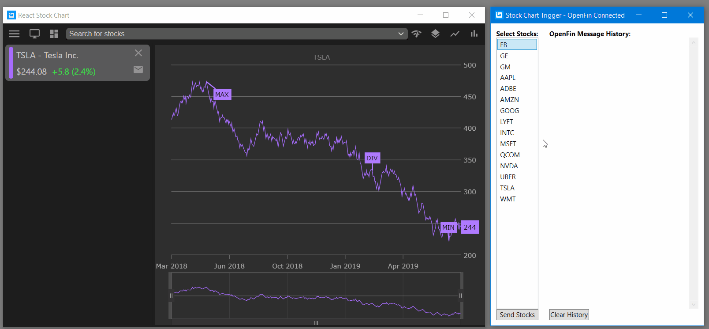

## WPF Stock Chart Trigger

This repository demonstrates how create and connect WPF application to [OpenFin](https://openfin.co/) desktop runtime and send [ViewChart](https://fdc3.finos.org/docs/1.0/intents-intro) intent messages via [FDC3](https://fdc3.finos.org/docs/1.0/fdc3-intro) protocol. Also, this application displays all messages sent using this protocol. This is useful to test other applications such as
[React Stock Chart](https://github.com/Infragistics/demo-apps/tree/master/react/open-fin-stock-chart) app hosted in OpenFin launcher.

## Table of Contents

- [Setup](#Setup)
- [Running](#Running)
- [Testing](#Testing)

## Setup

Setup this project by following these instructions:

- open **VS 2017** as administrator
- open **OpenFinStockChartTrigger.sln**
- in solution exploerer, right click on the solution
- select **Restore NuGet Packages** menu item

## Running

- select **Debug** - **Start (Without) Debugging** menu item

or
- press `CTRL` + `F5` keys
- wait for the app to connect to **OpenFin** desktop runtime

## Testing

While this WFP app is running, you can also run other applications that use [FDC3](https://fdc3.finos.org/docs/1.0/fdc3-intro) protocol. For example, you can run React app called [React Stock Chart](https://github.com/Infragistics/demo-apps/tree/master/react/open-fin-stock-chart) to send stock symbol using [FDC3 ViewChart](https://fdc3.finos.org/docs/1.0/intents-intro) to this React app.

